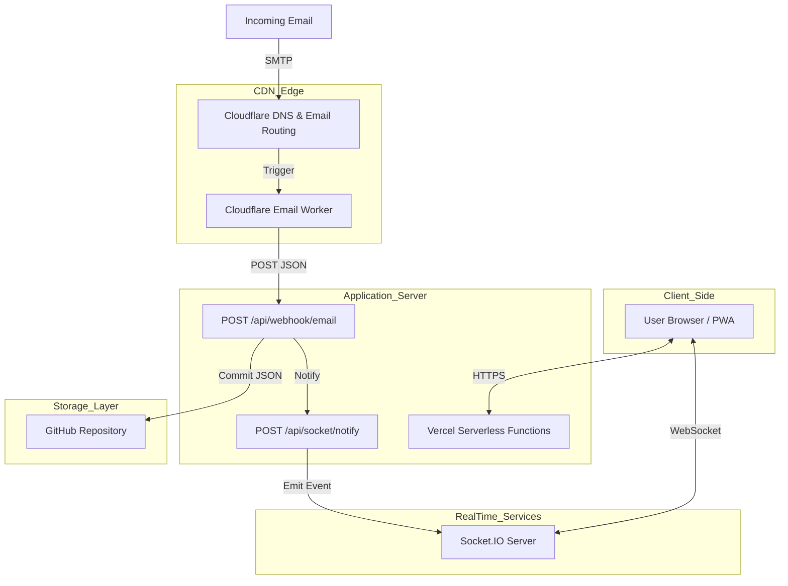
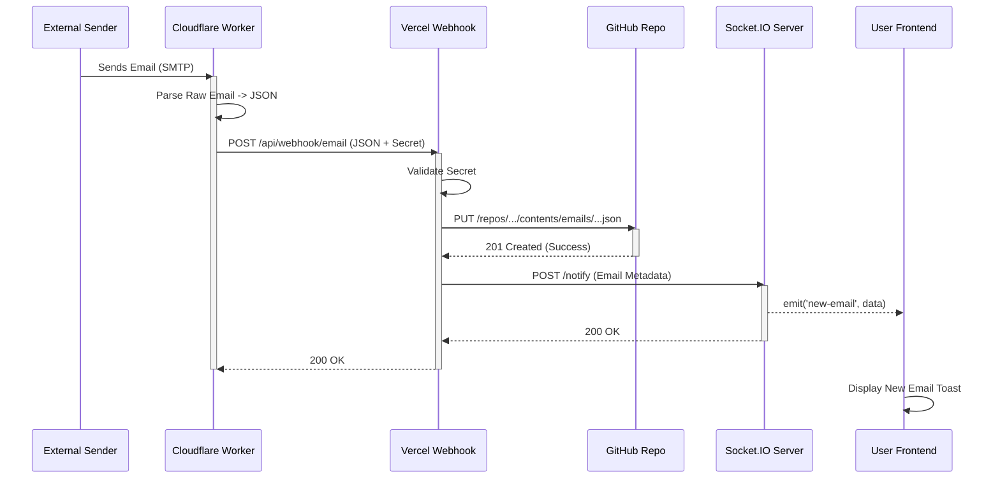
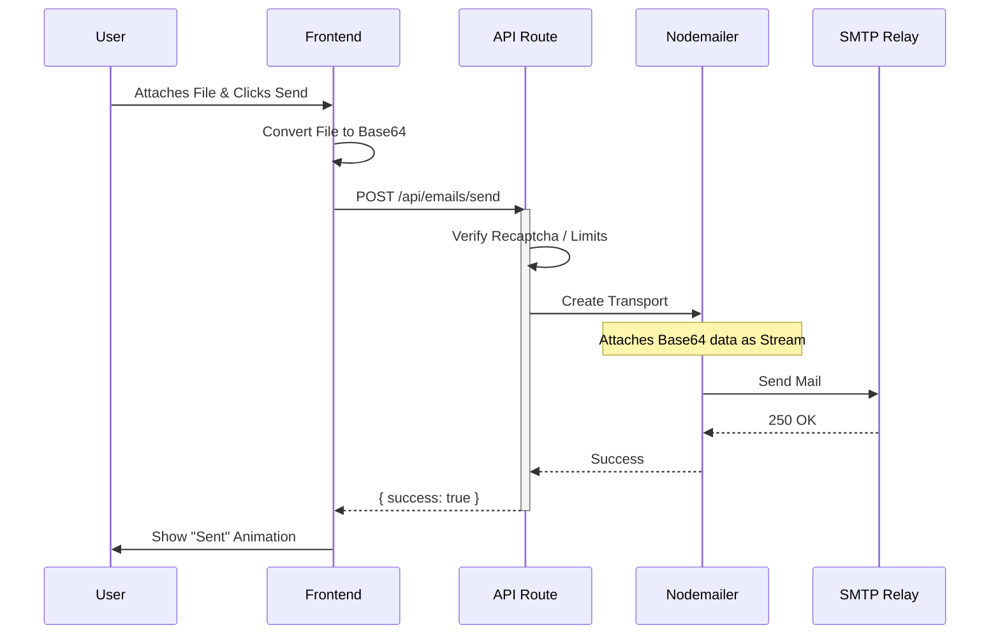
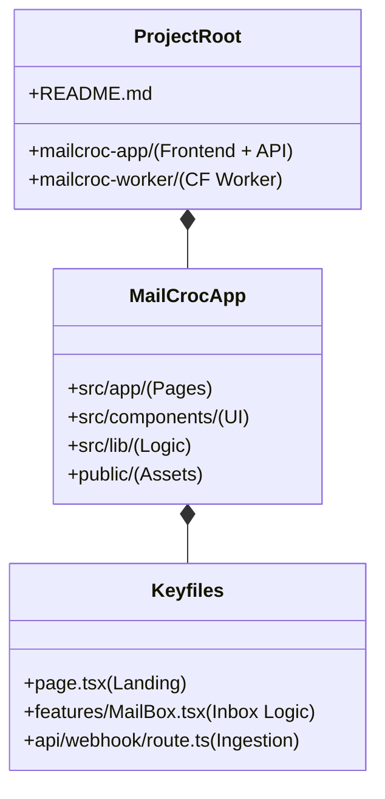

# MailCroc System Architecture

This document provides a detailed technical breakdown of the MailCroc system, separated into logical components and workflows.

## 1. High-Level Architecture

The system is built on a serverless, event-driven architecture to ensure scalability and zero maintenance.

---

## 2. Component Breakdown

### A. Email Ingestion (The "Croc" Worker)
*   **Role**: Acts as the SMTP ingress.
*   **Technology**: Cloudflare Email Workers.
*   **Function**: Intercepts incoming emails to `*@mailcroc.qzz.io`, parses the raw MIME data using `postal-mime` (or similar), and forwards a clean JSON payload to our Vercel Webhook.
*   **Security**: Uses a shared `WEBHOOK_SECRET` to authenticate with the Vercel API.

### B. The Application Core (Vercel)
*   **Role**: Frontend UI and API coordination.
*   **Technology**: Next.js 14 (App Router).
*   **Key Responsibilities**:
    *   **UI**: Renders the inbox, generates identities, and handles file uploads.
    *   **Webhook**: Receives parsed emails from Cloudflare.
    *   **Storage Access**: Communicates with GitHub API to save/read emails.

### C. The "Database" (GitHub)
*   **Role**: Persistent storage without a database server.
*   **Technology**: GitHub REST API.
*   **Structure**:
    *   Each email is a JSON file.
    *   Path format: `emails/{domain}/{username}/{messageId}.json`.
    *   This allows for "infinite" scalability for a temporary mail service without cost.

---

## 3. Workflows in Detail

### Workflow A: Receiving an Email
This sequence diagram illustrates exactly what happens when someone sends an email to a MailCroc address.

### Workflow B: Sending/Replying (with Attachments)
How MailCroc handles outgoing mail and file attachments.

---

## 4. Directory Structure

