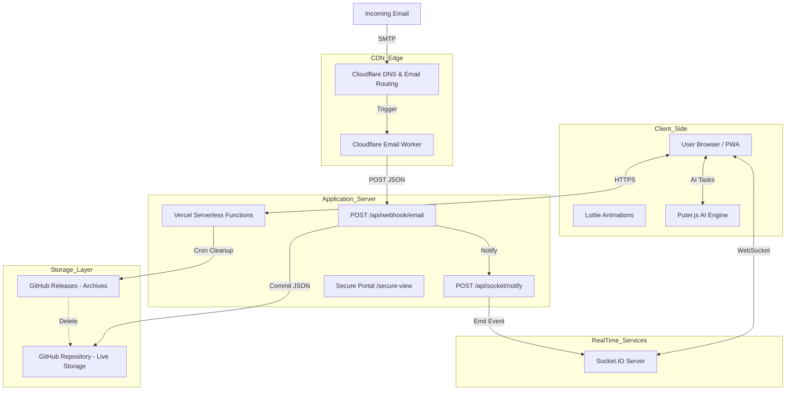
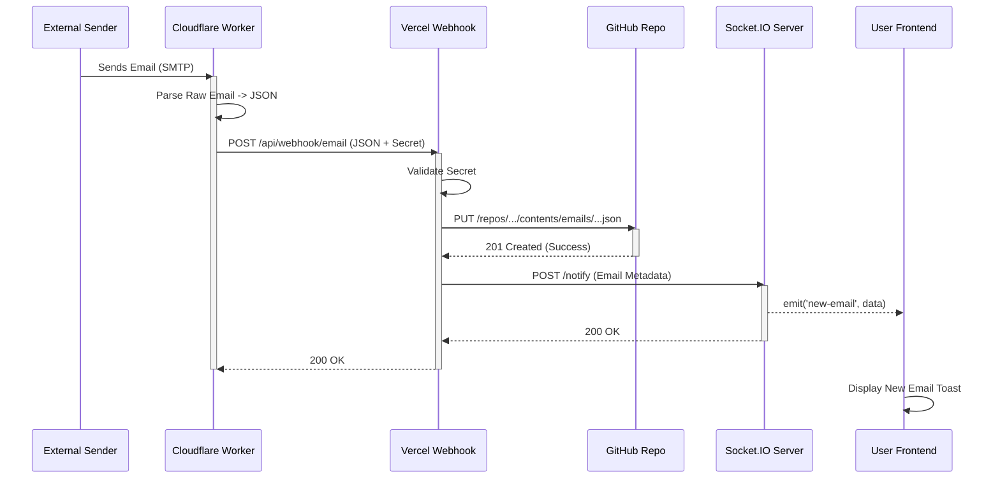
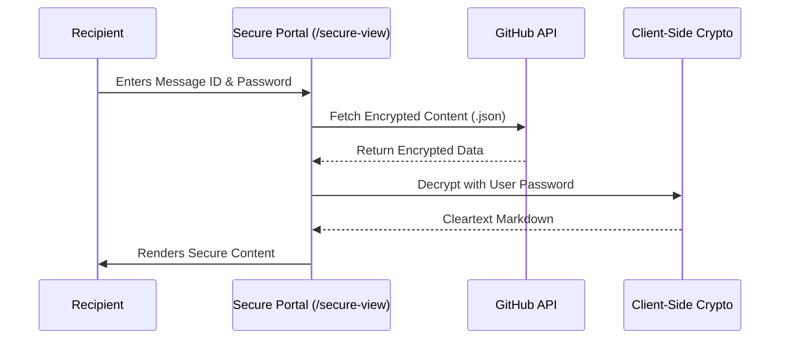
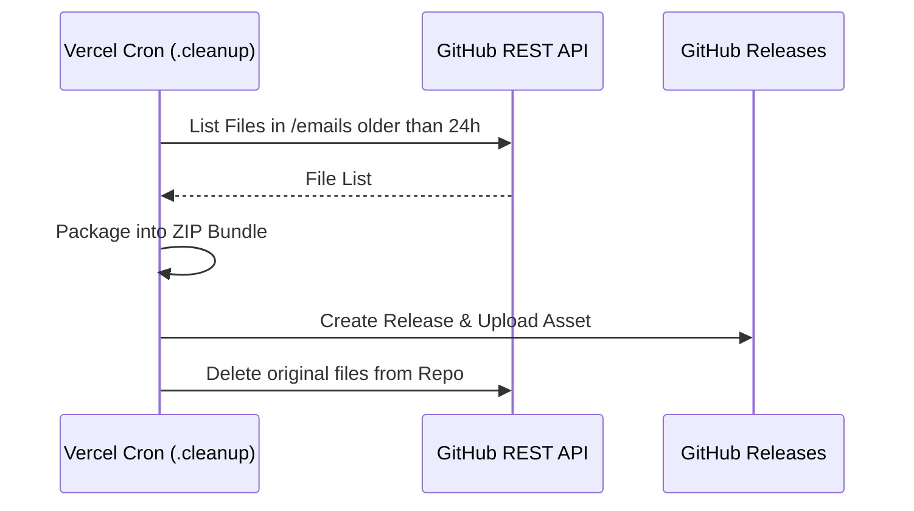
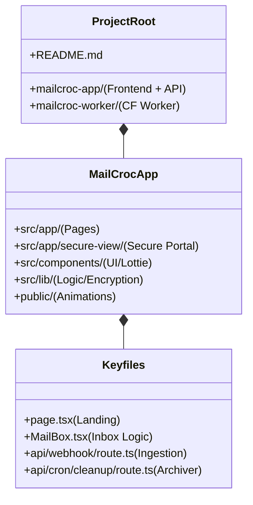

# MailCroc System Architecture

This document provides a detailed technical breakdown of the MailCroc system, separated into logical components and workflows.

## 1. High-Level Architecture

The system is built on a serverless, event-driven architecture to ensure scalability and zero maintenance.

---

## 2. Component Breakdown

### A. Email Ingestion (The "Croc" Worker)
*   **Role**: Acts as the SMTP ingress.
*   **Technology**: Cloudflare Email Workers.
*   **Function**: Intercepts incoming emails, parses raw MIME data, and forwards a clean JSON payload to our Vercel Webhook.

### B. The Application Core (Vercel)
*   **Role**: Frontend UI and API coordination.
*   **Technology**: Next.js 14 (App Router).
*   **Key Responsibilities**:
    *   **UI**: Renders the inbox, generates identities, and handles file uploads.
    *   **Secure Portal**: Decrypts and displays password-protected messages client-side.
    *   **Storage Access**: Communicates with GitHub API to save/read emails.

### C. AI Engine (Puter.js Integration)
*   **Role**: Intelligent email management.
*   **Capabilities**: 
    *   **Summarization**: Condenses long emails into bullet points.
    *   **Help me write**: Generates replies or new emails based on topics.
    *   **Speech-to-Text**: Reads emails aloud.
*   **Fallback**: If Puter.js is unavailable, the system transparently falls back to individual LLM API endpoints.

### D. The Storage System (GitHub Multi-Tier)
*   **Live Store**: GitHub REST API stores emails as JSON files in a private repo.
*   **Archive Store**: An automated cron job bundles old emails into ZIP assets and uploads them to **GitHub Releases**, keeping the live repository clean and performant.

---

## 3. Workflows in Detail

### Workflow A: Receiving an Email (Live)

### Workflow B: Secure Portal Access (Client-Side Encryption)

### Workflow C: GitHub Archival Cron

---

## 4. Directory Structure

