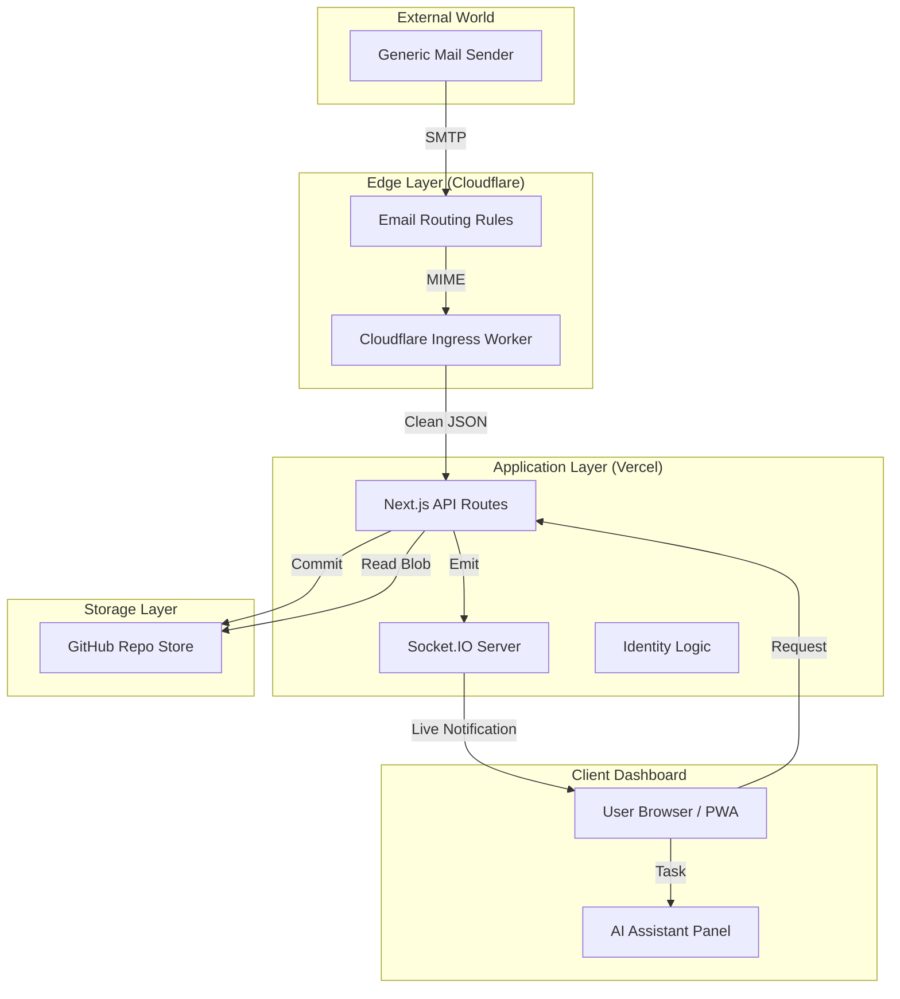

# 🐊 MailCroc System Architecture & Technical Documentation

MailCroc is a premium, high-privacy disposable email platform engineered for the modern web. This document outlines the technology stack, core infrastructure, and functional logic behind every feature.

---

## 🏗️ 1. Core Architecture Overview

MailCroc operates on a **Serverless-First** architecture, combining the edge performance of Cloudflare with the scalability of GitHub as a data store. This approach ensures high availability with near-zero maintenance.

### **The Digital Flow Diagram**

```mermaid
graph TD
    subgraph "External World"
        Sender[Generic Mail Sender]
    end

    subgraph "Edge Layer (Cloudflare)"
        CF_Worker[Cloudflare Ingress Worker]
        SMTP_Route[Email Routing Rules]
    end

    subgraph "Application Layer (Vercel)"
        Next_API[Next.js API Routes]
        SocketIO[Socket.IO Server]
        Auth[Identity Logic]
    end

    subgraph "Storage Layer"
        GitHub_DB[GitHub Repo Store]
    end

    subgraph "Client Dashboard"
        Browser[User Browser / PWA]
        AI_Draft[AI Assistant Panel]
    end

    %% Email Path
    Sender -->|SMTP| SMTP_Route
    SMTP_Route -->|MIME| CF_Worker
    CF_Worker -->|Clean JSON| Next_API
    Next_API -->|Commit| GitHub_DB
    Next_API -->|Emit| SocketIO
    SocketIO -->|Live Notification| Browser

    %% User Path
    Browser -->|Request| Next_API
    Next_API -->|Read Blob| GitHub_DB
    Browser -->|Task| AI_Draft
```

---

## 🛠️ 2. Deep Dive Into Components

### **A. Ingress: The Mail Engine**
- **Cloudflare Email Workers**: Acts as the SMTP gatekeeper. It intercepts incoming emails for designated domains. Instead of storing them temporarily, it parses them immediately on the edge.
- **MailParser/Nodemailer**: Used in the worker to sanitize MIME objects, extract attachments, and prepare clean JSON payloads. This prevents malicious scripts or malformed data from ever reaching our central API.
- **Webhook Relay**: The worker converts email traffic into HTTP POST requests, relayed instantly to the Next.js API. This ensures "push" delivery rather than outdated "pull" polling.

### **B. Storage: GitHub as a Database**
- **GitHub API (@octokit/rest)**: A unique architectural choice. Instead of a traditional database, MailCroc uses the GitHub API to store email data as JSON files. This provides built-in versioning, high uptime, and an infinitely scalable free-tier storage pool.
- **Persistence Logic**: Each session creates a unique identifier, and emails are stored as blobs within that session's tree. When a session expires, the files are deleted or ignored, ensuring no long-term logs exist.

### **C. Real-Time: Socket.IO Sync**
- **Socket.io**: Enables millisecond-level synchronization. When the backend receives an email, it emits a `new_email` event. The client dashboard is in a constant listening state, meaning the email appears "live" without the user ever clicking refresh.

---

## 💻 3. Frontend Tech Stack & Libraries

We use the most modern React ecosystem to ensure the UI feels alive and responsive.

| Library | Functioning & Purpose |
| :--- | :--- |
| **Next.js 16+** | The backbone of the app. We use **App Router** for fast server-side transitions and **Middleware** for session protection. |
| **Lucide React** | Provides the entire icon suite. Every icon (Trash, Pin, Send) is a lightweight SVG component. |
| **Framer Motion** | Controls the "physics" of the app. Slide-ins, smooth fades, and button hover effects use its animation engine. |
| **Lottie-React** | Powers the high-end vector graphics you see on the "Sent" and "About" pages. These are JSON-based animations that stay sharp at any resolution. |
| **Tiptap Editor** | A headless rich-text editor used in the Compose Modal. It handles the formatting (bold, links, lists) while keeping the output clean for email clients. |
| **html2canvas / jspdf** | Works entirely in the browser to take a snapshot of your email and convert it into a downloadable PDF on the fly. |

---

## 🤖 4. Intelligence Suite (AI Engine)

MailCroc isn't just a mailbox; it's an assistant.

- **Primary Engine**: **OpenRouter** connects us to the world's most powerful LLMs (like Claude or GPT-4). It's the logic behind "Help me write" and "Formalize my draft."
- **Edge Intelligence**: **Puter.js** is our high-speed fallback. If the main API is busy, Puter handles text generation and **Vision Analysis** (reading text from images) instantly.
- **Voice System**: **ElevenLabs** converts text into audio. We send the cleaned email text to their API and stream back a high-quality Voice (Male/Female) to read it aloud.

---

## 🛡️ 5. Key Feature Functioning

### **Privacy: Identity Generation**
The algorithm in `lib/domains.ts` uses advanced strategies like:
- **Plus Tagging**: `user+amazon@mailcroc.qzz.io` to track who sells your data.
- **Dot Trickery**: Gmail-style `u.s.e.r@...` to bypass "one email per account" limits.
- **Domain Shuffling**: Randomly cycling through stealth domains to stay ahead of blocklists.

### **Security: Hide Subject**
When you toggle this, our backend intercepts the `subject` field and replaces it with a **Witty Alternative** from a pre-defined list. This ensures that even if someone metadata-sniffs the email, they have no idea what it's truly about until the recipient opens it.

### **Secure View Protection**
Uses **Base64 Sanitization** and browser-side decryption. Even if our database was breached, the messages are stored in an encrypted state (MC-LOCKED). Only the user with the correct code can unlock them in their private browser session.

---

Designed with ❤️ by the **MailCroc Developer Team**.
