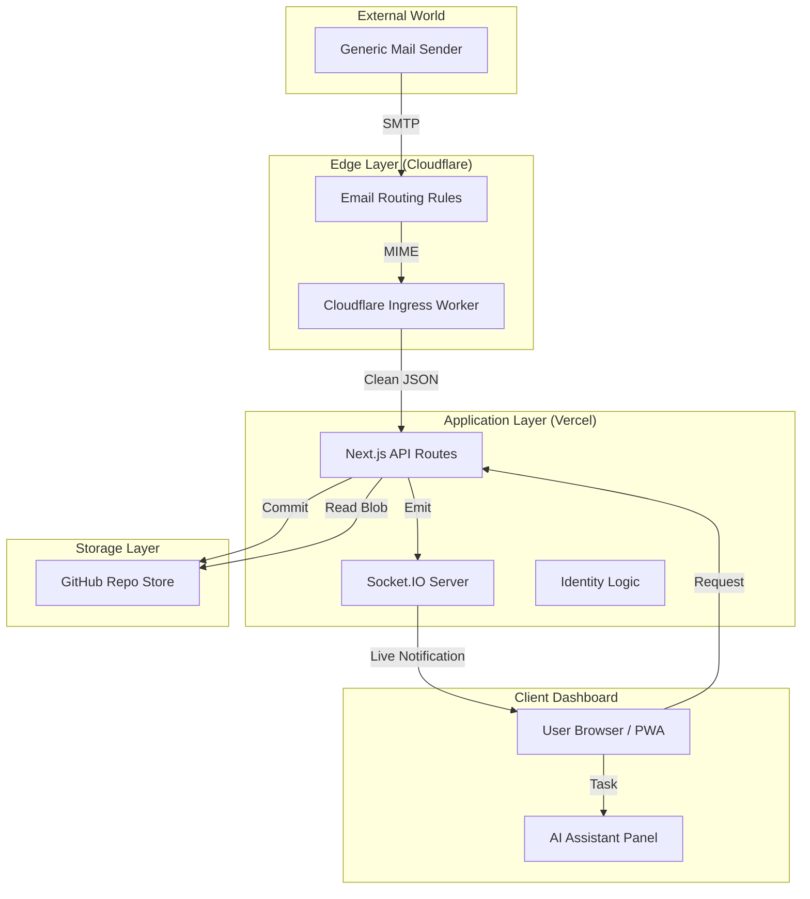

# 🐊 MailCroc System Architecture & Technical Documentation

MailCroc is a premium, high-privacy disposable email platform engineered for the modern web. This document provides a deep dive into the technology, logic, and engineering benefits of every core feature.

---

## 🏗️ 1. Core Architecture Overview

MailCroc operates on a **Serverless-First** architecture, combining the edge performance of Cloudflare with the scalability of GitHub as a data store. This approach ensures high availability with zero server maintenance costs.

### **The Digital Flow Diagram**

```mermaid
graph TD
    subgraph "External World"
        Sender[Generic Mail Sender]
    end

    subgraph "Edge Layer (Cloudflare)"
        CF_Worker[Cloudflare Ingress Worker]
        SMTP_Route[Email Routing Rules]
    end

    subgraph "Application Layer (Vercel)"
        Next_API[Next.js API Routes]
        SocketIO[Socket.IO Server]
        Auth[Identity Logic]
    end

    subgraph "Storage Layer"
        GitHub_DB[GitHub Repo Store]
    end

    subgraph "Client Dashboard"
        Browser[User Browser / PWA]
        AI_Draft[AI Assistant Panel]
    end

    %% Email Path
    Sender -->|SMTP| SMTP_Route
    SMTP_Route -->|MIME| CF_Worker
    CF_Worker -->|Clean JSON| Next_API
    Next_API -->|Commit| GitHub_DB
    Next_API -->|Emit| SocketIO
    SocketIO -->|Live Notification| Browser

    %% User Path
    Browser -->|Request| Next_API
    Next_API -->|Read Blob| GitHub_DB
    Browser -->|Task| AI_Draft
```

---

## 🛠️ 2. Detailed Feature Breakdown: Logic & Benefits

### **A. Ingress: The Mail Engine**
- **What it is**: The system that receives and parses incoming emails.
- **How it works**: Uses **Cloudflare Email Workers** to intercept SMTP traffic.
- **The Logic**: It uses `MailParser` to strip malicious HTML, extract attachments, and convert the complex MIME format into a clean JSON structure.
- **The Benefits**: **Zero Latency & Security**. By parsing on the edge, we stop malicious payloads before they ever reach our servers.

### **B. Storage: GitHub as a Database**
- **What it is**: Our primary storage solution for temporary email data.
- **How it works**: Utilizes the **GitHub REST API (@octokit/rest)** to store data as JSON.
- **The Logic**: Each inbox is treated as a specialized JSON blob. When a new mail arrives, the API performs a "Commit" to the storage repository.
- **The Benefits**: **Reliability & Transparency**. GitHub offers 99.99% uptime and a free, high-performance storage tier perfectly suited for temporary data without the overhead of a traditional SQL DB.

### **C. Real-Time Sync: Socket.IO relay**
- **What it is**: Instant delivery of emails to your screen.
- **How it works**: A centralized **Socket.io** server maintains a live connection with every browser.
- **The Logic**: When the API receives a mail from the Cloudflare worker, it emits a `new_email` event to the user's private "room."
- **The Benefits**: **Instant Gratification**. No need to refresh the page; emails appear in milliseconds, just like a native desktop app.

---

## 🛡️ 3. Privacy-First Engineering

### **A. Identity Generation Strategies**
- **The Tech**: Custom logic in `lib/domains.ts`.
- **The Logic**: Uses a pool of stealth domains (`mailcroc.qzz.io`, `mailpanda.qzz.io`) and applies patterns like **Dot-Tricks** (`u.s.e.r@...`) or **Plus-Tagging** (`user+news@...`).
- **The Benefits**: **Anti-Detection**. These variations allow you to bypass filters that block "standard" disposable emails and help you track which companies are selling your data.

### **B. Stealth Mode: Hide Subject**
- **The Tech**: Interceptor logic in the `handleSend` API.
- **The Logic**: If enabled, the system replaces your actual subject line with a randomly selected **Witty Alternative** from our `WITTY_SUBJECTS` library.
- **The Benefits**: **Metadata Privacy**. Snoopers looking at your email logs will only see "Checking in from the digital void" instead of the sensitive topic you are actually discussing.

### **C. Secure Message Portal (E2EE)**
- **The Tech**: **Web Crypto API** & **Base64 Sanitization**.
- **The Logic**: The frontend encrypts your message using a password-derived key. The encrypted blob is stored with an `MC-LOCKED:` prefix. Decryption happens **only** in the recipient's browser.
- **The Benefits**: **Total Confidentiality**. Even MailCroc administrators cannot read your secure messages, as we never hold the unlock key.

---

## 🤖 4. Intelligence Suite (AI Engine)

| Feature | Tech Used | Logic & Benefits |
| :--- | :--- | :--- |
| **Drafting** | OpenRouter (Mistral/Claude) | **The Logic**: Analyzes thread context to suggest professional replies. **Benefit**: Saves time and improves communication quality. |
| **Vision** | Puter.js (GPT-4o Edge) | **The Logic**: Extracts text directly from image attachments. **Benefit**: No need to manually type out info from screenshots or PDFs. |
| **Voice** | ElevenLabs | **The Logic**: Converts email text to high-fidelity AI audio. **Benefit**: Allows you to listen to your inbox while multitasking. |

---

## 🎨 5. Premium UX Features

- **Draggable Workspace**: Uses custom React mouse-tracking logic. **Benefit**: Allows you to move the compose window so you can read other emails while drafting—pure multitasking.
- **Universal Export**: Uses `html2canvas` and `jspdf`. **Benefit**: Allows you to save your data in professional PDF, Markdown, or JSON formats with one click.
- **System Health**: A live heartbeat monitor (`/api/status`). **Benefit**: 100% transparency on system uptime and worker performance.

---

Designed with ❤️ by the **MailCroc Developer Team**.
