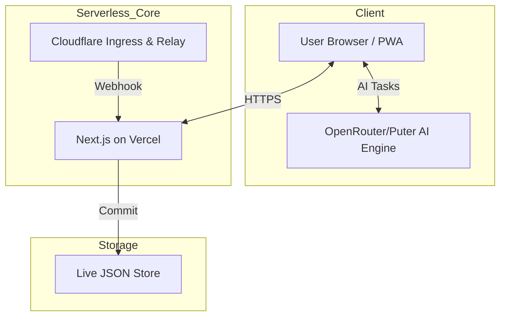

<p align="center">
  
</p>

<h1 align="center">MailCroc</h1>

<p align="center">
  <strong>The Ultimate Real-Time Disposable Email Service</strong>
</p>

<p align="center">
  <a href="#-key-features">Features</a> •
  <a href="#-architecture">Architecture</a> •
  <a href="#-getting-started">Getting Started</a> •
  <a href="#-usage-guide">Usage</a> •
  <a href="#-deployment">Deployment</a>
</p>

---

**MailCroc** is a next-generation temporary email service built for privacy, speed, and modern web standards. Unlike traditional temp mail services that are riddled with ads and delays, MailCroc offers a premium, ad-free experience with **instant WebSocket delivery**, **AI-powered tools**, and **end-to-end password protection**.

It relies on a serverless architecture, using **Cloudflare Email Workers** to ingest emails and **GitHub** as a free, high-tier storage solution.

## 🚀 Key Features

### 🛡️ Privacy & Security
*   **🔐 Password Protected Emails**: Send encrypted emails to external addresses (Gmail/Outlook) via a secure web portal. Only accessible with your shared code.
*   **Zero Logs**: We do not store IP addresses or browser fingerprints.
*   **Stealth Mode (Email Masking)**: Uses a pool of 100+ domains to bypass "unacceptable email" filters. Connect your own personal Gmail to send anonymous emails.
*   **Auto-Expiry Sessions**: Instantly expire and wipe your temporary inbox when you're done.

### 🤖 AI-Powered Intelligence
*   **Help me write (Smart Compose)**: Generate professional replies or new emails instantly using our integrated AI engine (Powered by OpenRouter & Puter.js).
*   **Smart Summarization**: Get the gist of long emails with one click.
*   **Extract Details**: AI can intelligently extract receipts, meeting times, and key details from threads.
*   **Vision & Voice**: Extract text from attached images and have your emails read aloud by professional AI voices (ElevenLabs).

### ⚡ Real-Time Experience
*   **Instant Delivery**: Emails appear in your inbox milliseconds after they are received via Socket.IO.
*   **Live UI Updates**: The interface updates instantly. No more hitting the refresh button.

### 📧 Advanced Email Capabilities
*   **Reply & Compose**: Full support for sending new emails and replying to received ones.
*   **Universal Attachments**: Send and receive files (Images, PDFs, Docs, Audio, Video, Archives).
*   **Export Options**: One-click export of emails to **PDF**, **Markdown**, or **JSON**.
*   **Address Variations**: Generate standard aliases, +tags, dot-tricks, and custom handles.

### 💻 Modern UI/UX
*   **Premium Design**: Features stunning micro-animations (Lottie), dynamic layout, and glassmorphism.
*   **PWA Support**: Installable as a native-like app on iOS, Android, and Desktop with offline support.
*   **Draggable Compose**: A dynamic, draggable workspace for multitasking.
*   **Unified Dashboard**: Monitor system health directly from the built-in status page.
*   **Offline Mode**: View previously loaded emails even without an internet connection.

## 🏗️ Architecture

MailCroc operates on a 100% serverless infrastructure, ensuring high availability and zero maintenance costs.


```mermaid
graph TD
    subgraph Client
        Browser[User Browser / PWA]
        AI[OpenRouter/Puter AI Engine]
    end

    subgraph Serverless_Core
        Vercel[Next.js on Vercel]
        CF_Worker[Cloudflare Ingress & Relay]
    end

    subgraph Storage
        GitHub_Repo[Live JSON Store]
    end

    %% Flows
    Browser <-->|HTTPS| Vercel
    CF_Worker -->|Webhook| Vercel
    Vercel -->|Commit| GitHub_Repo
    Browser <-->|AI Tasks| AI
```

## 🛠️ Tech Stack

-   **Framework**: [Next.js 14+ (App Router)](https://nextjs.org/)
-   **Language**: [TypeScript](https://www.typescriptlang.org/)
-   **AI Engine**: OpenRouter, ElevenLabs, [Puter.js](https://js.puter.com/)
-   **Animations**: Lottie (via `lottie-react`), Framer Motion
-   **Real-time**: Socket.IO
-   **Deployment**: Vercel & Cloudflare Workers

## 🏁 Getting Started

### Prerequisites
-   Node.js 18+
-   A generic GitHub account (for serverless DB storage)
-   Cloudflare account (for email ingress routing)
-   OpenRouter API Key (for backend AI)

### Local Development

1.  **Clone the repository**
    ```bash
    git clone https://github.com/cybe4sent1nel/mailcroc.git
    cd mailcroc
    ```

2.  **Install Dependencies**
    ```bash
    cd mailcroc-app
    npm install
    ```

3.  **Run the App**
    ```bash
    npm run dev:all
    ```
    This starts the Next.js frontend and the local mail server concurrently. Visit `http://localhost:3000`.

## 📦 Deployment

### Vercel (Frontend & API)
1.  Push code to GitHub and import to Vercel/Render.
2.  Set the **Root Directory** to `mailcroc-app`.
3.  Add `GITHUB_TOKEN`, `GITHUB_REPO_OWNER`, and `GITHUB_REPO_NAME` to Env Vars.

### Cloudflare (Email Ingress)
1.  Deploy the worker in `mailcroc-worker/` via `npx wrangler deploy`.
2.  Route your domain's email traffic to the worker in the Cloudflare Dashboard under Email Routing rules.

## 📖 Usage Guide

1.  **Generate Identity**: Select an identity type (Standard, Plus, Dot, or Gmail).
2.  **Secure Your Mail**: Toggle "Password Protection" in the compose modal to send an encrypted link.
3.  **Use AI**: Click "Help me write" in the compose window to generate content instantly.
4.  **Export**: Use the export dropdown to save emails as PDF or Markdown.

---

<p align="center">
  Designed and developed by <a href="https://fahadops.vercel.app"><b>Fahad Khan</b></a>
</p>
